# AstroLab

[](https://badge.fury.io/py/astrolab-cli)
[](https://www.python.org/downloads/)
[](https://api.nasa.gov/)

A study tool for astronomy and physics built for the terminal. No heavy web interfaces, just real NASA data and Gemini AI-generated quizzes to help you study between lectures.

I built this because reading blocks of theoretical physics gets boring fast. With AstroLab, I pull the Astronomy Picture of the Day (APOD) and let AI create interactive, university-level quizzes and flashcards out of it.


## See it in action


## The Tech & Why
- **Python + Rich:** I love CLI tools. Rich makes the terminal look great without a browser.
- **NASA API:** Real-world data is better than textbook examples.
- **Gemini 2.5 Flash:** Fast enough to generate quizzes and deep dives on the fly.
- **Offline / Smart Demo Mode:** I coded a fallback caching system. If you don't have API keys or internet, the app won't crash. It serves pre-generated, high-quality offline quizzes. I know what it's like to have your code break during a review because of missing .env files, so I fixed that friction.

## Feature Gallery

**NASA Astronomy Picture of the Day (APOD)**
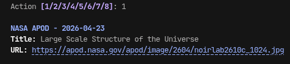

**Surprise Me! (Random Historical APOD)**
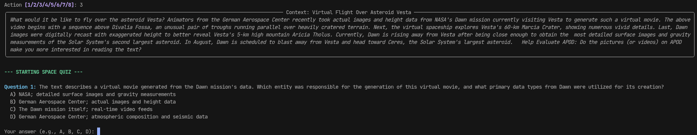

**Generate Study Flashcards**
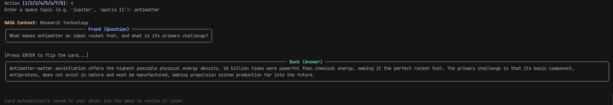

**Review Your Personal Deck**
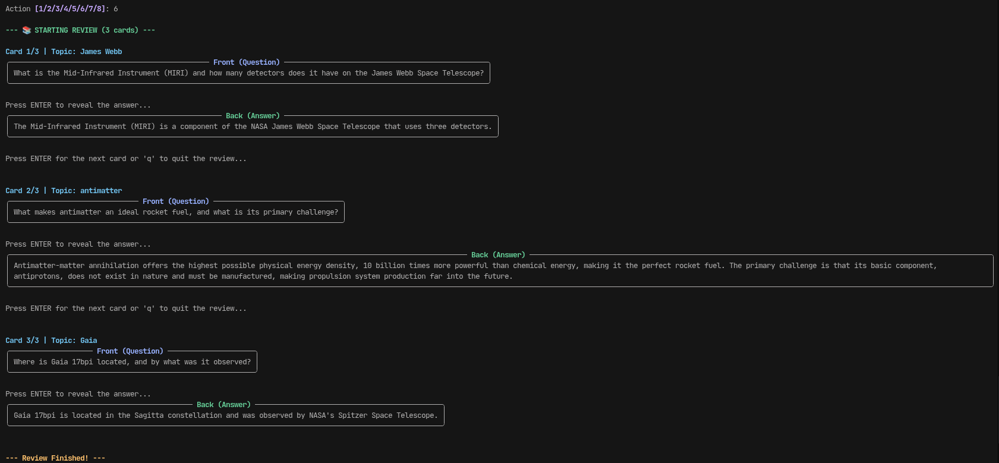

**System Health Check**
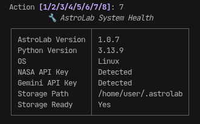

## Try it out
I packaged this up so anyone can run it instantly:

```bash
pip install astrolab-cli
```

Then, just run:
```bash
astrolab
```

### API Keys (Optional)
If you want to use your own keys for real-time generation:
- Get a **NASA API Key** at [api.nasa.gov](https://api.nasa.gov/)
- Get a **Google Gemini Key** at [aistudio.google.com](https://aistudio.google.com/)

## Track Your Progress & Deep Dive
I didn't just want to answer questions; I wanted to see if I was improving. The app features local persistence with a stats tracker.

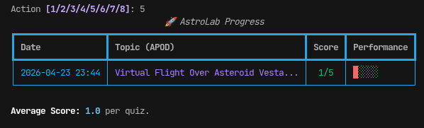

If you get a quiz question wrong, AstroLab doesn't just give you the answer. It asks if you want a "Deep Dive", where it acts like a physics professor and explains the exact concept you missed using everyday analogies right in the terminal.

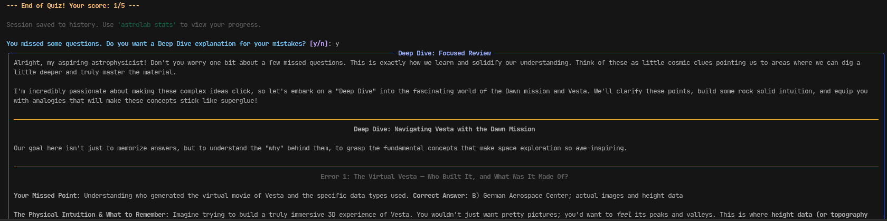
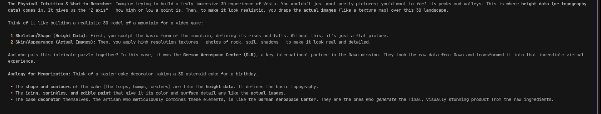
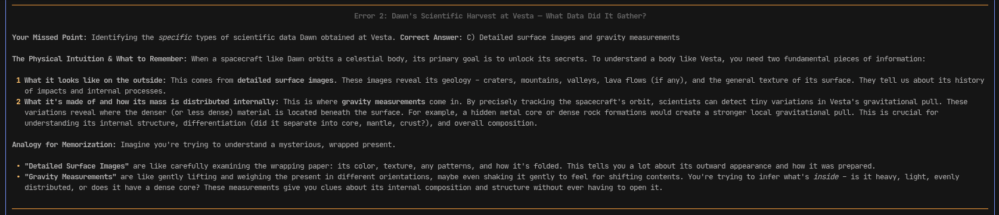
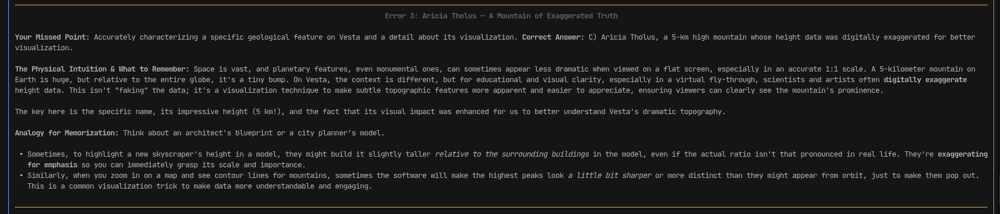
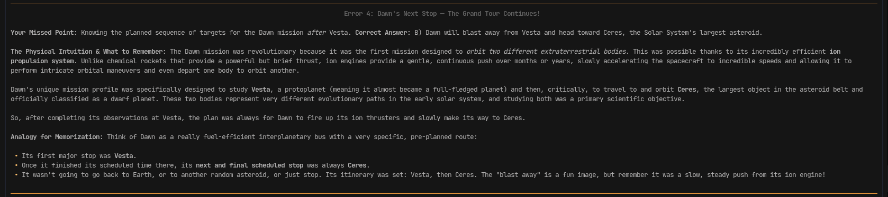
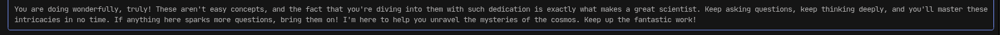

---
*Built for the Hack Club Sidequest Challenger.*